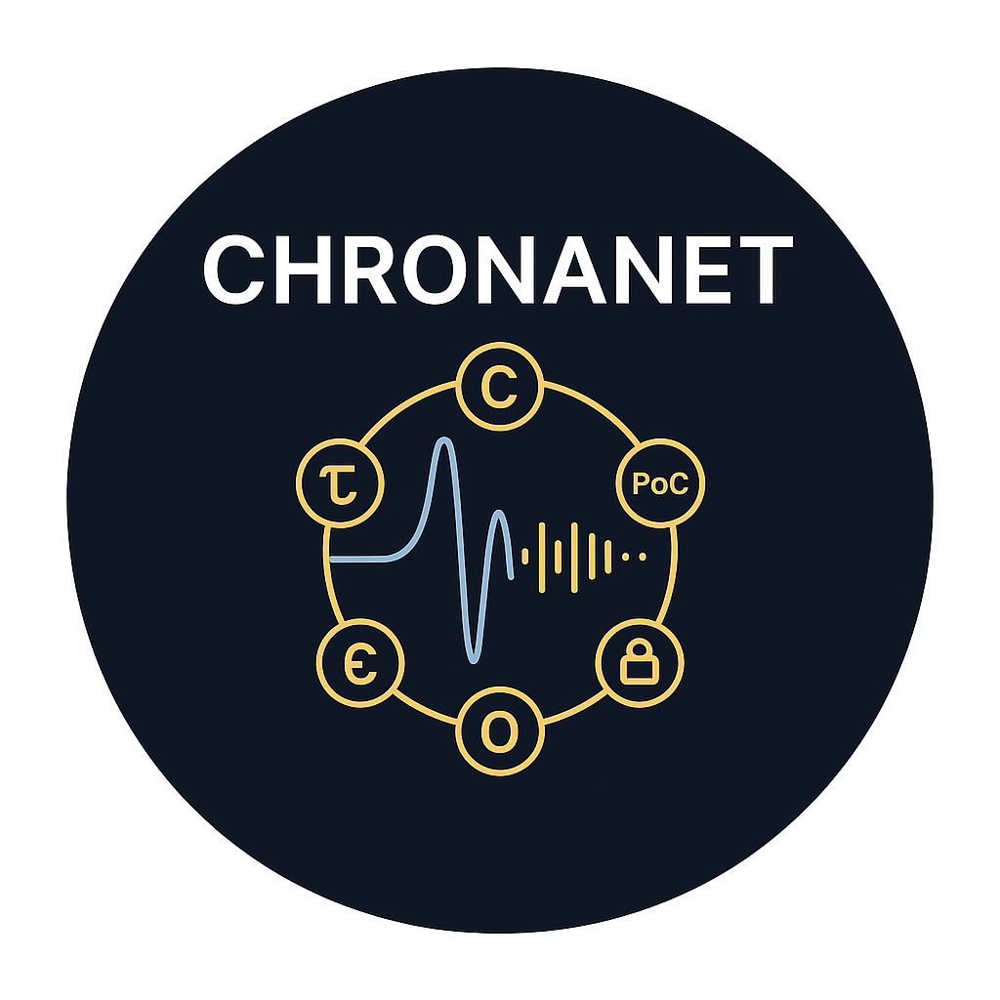

HEAD
# ChronaNet

ChronaNet is a decentralized network powered by the ChronaCoin Protocol, featuring a novel **Proof of Coherence (PoC)** consensus mechanism. Built with quantum-temporal cryptography and chrono-algorithmic architecture, ChronaNet enables secure, scalable, and efficient blockchain transactions.

ChronaNet™ and ChronaCoin™ are trademarks of Luis Morató de Dalmases.

## Table of Contents

- [Overview](#overview)
- [Features](#features)
- [Installation](#installation)
- [Usage](#usage)
- [Joining the Testnet](#joining-the-testnet)
- [License](#license)
- [Documentation](#documentation)
- [Contributing](#contributing)
- [Contact](#contact)

## Overview

ChronaNet introduces a paradigm shift in blockchain technology by leveraging quantum-inspired temporal dynamics and a coherence-based consensus model. The ChronaCoin Protocol, developed by Luis Morató de Dalmases (2025), integrates advanced cryptographic techniques to ensure security and decentralization.

This repository contains the core implementation of ChronaNet, including the simulation framework, wallet management, and blockchain ledger. The project is open for educational, research, and personal experimentation under the MIT License, with commercial use requiring a separate license.

## Features

- **Proof of Coherence (PoC)**: A consensus mechanism based on network-wide coherence of quantum-temporal states.
- **Quantum-Temporal Cryptography**: Secure transaction signing using tesseract-based phase keys.
- **Chrono-Algorithmic Architecture**: Efficient block creation and validation with spectral hashing.
- **Decentralized Wallet**: Manage Chronacoins with a secure, tesseract-linked wallet.
- **Web Dashboard**: Visualize node status, blockchain, and transaction history using Streamlit.

## Installation

To run ChronaNet locally, follow these steps:

1. **Clone the repository**:
   ```bash
   git clone https://github.com/ChronaNet
   cd ChronaNet

<p align="center">
  
</p>

<p align="center">
  
</p>

# ChronaNet

**ChronaNet** is a next-generation decentralized blockchain protocol based on spectral coherence and temporal resonance. Inspired by the **Theory of Time**, it introduces a new consensus mechanism — **Proof of Coherence (PoC)** — and uses **Tavari encryption**, quantum tesseracts, and a real-time dashboard to redefine how trust and synchronization are achieved in distributed systems.

---

## 🔷 Features

- 💠 **Chronacoins** — Native currency used to reward validator nodes.
- 📡 **Proof of Coherence (PoC)** — Spectral-temporal consensus model.
- 🔐 **Tavari Encryption** — Coded messages through resonance and symbolic modulation.
- 🧠 **Theory of Time Framework** — Uses T8 tesseracts, FFT, and quantum phase signatures.
- 🌐 **HTTP Node Communication** — Flask-based inter-node propagation.
- 📊 **Live Dashboard** — Streamlit-based real-time visualization of the network.

---

## 📁 Project Structure

```plaintext
ChronaNet/
├── chronanet_node5.py            # Main executable node code
├── 1 - 5.pdf                     # Whitepaper with full theoretical and technical model
├── README.md                    # Project description
├── LICENSE                      # MIT license
├── requirements.txt             # Python dependencies
├── banner.png                   # Visual project banner
├── ledger_examples/
│   ├── ledger_Node_1.json       # Local validated transactions
│   ├── blockchain_Node_1.json   # Persistent blockchain history
│   └── wallet_Node_1.json       # Wallet with balance and history
├── assets/
│   ├── architecture.png         # System architecture
│   ├── dashboard.png            # Dashboard screenshot
│   ├── spectral_hash.png        # FFT hash example
│   └── wallet_history.png       # Wallet view
>>>>>>> d323bb4b1003c68d8d6703c5859b8de4e111a411
