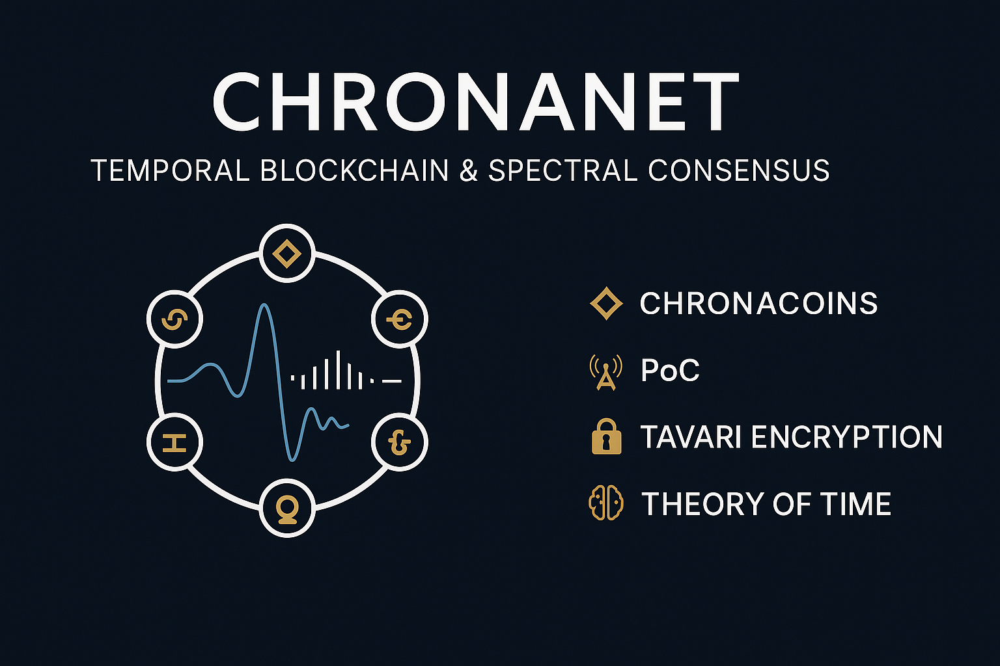

  

# ChronaNet
ChronaNet is a next-generation temporal blockchain protocol based on spectral coherence and quantum resonance.  💠 Chronacoins | 📡 Proof of Coherence (PoC) | 🔐 Tavari Encryption | 🧠 Theory of Time
